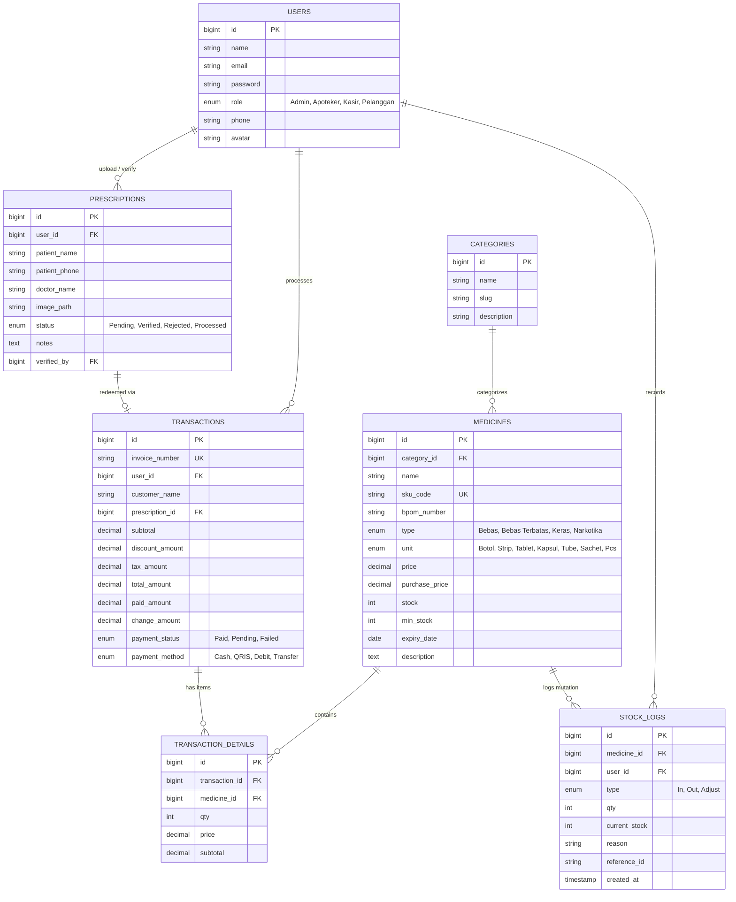

# 🏥 Apotek Budi Asih - Sistem Informasi Manajemen Apotek & POS Kasir Modern

Sistem Informasi Manajemen Apotek (**Apotek Budi Asih**) yang dirancang untuk menjaga integritas transaksi, penelusuran resep dokter, audit pergerakan stok (*stock logs*), dan akurasi pelaporan keuangan apotek sesuai standar BPOM RI.

---

## 🗄️ 1. Struktur Database Relasional (Skema Tabel)



---

## 📂 2. Struktur Direktori Project (Directory Tree)

```plaintext
apotek-app/
├── app/
│   ├── Http/
│   │   ├── Controllers/
│   │   │   ├── AuthController.php          # Login, Role Sanctum
│   │   │   ├── MedicineController.php      # Manajemen master obat & stok
│   │   │   ├── PrescriptionController.php  # Unggah & verifikasi resep dokter
│   │   │   ├── TransactionController.php   # POS Kasir & Transaksi atomik
│   │   │   └── ReportController.php        # Ekspor PDF/Excel laporan
│   │   ├── Requests/                       # Form Request Validasi
│   │   │   ├── StoreMedicineRequest.php
│   │   │   └── UploadPrescriptionRequest.php
│   │   └── Middleware/
│   │       └── CheckRole.php               # Akses kontrol (Admin/Apoteker/Kasir)
│   ├── Models/                             # Eloquent Models
│   │   ├── User.php
│   │   ├── Category.php
│   │   ├── Medicine.php
│   │   ├── Prescription.php
│   │   ├── Transaction.php
│   │   ├── TransactionDetail.php
│   │   └── StockLog.php
│   ├── Services/                           # Business Logic Terpisah
│   │   ├── ImageUploadService.php          # Upload berkas resep & storage
│   │   ├── StockService.php                # Mutasi stok atomik (lockForUpdate)
│   │   └── ReportService.php               # Format data analitik PDF & Excel
│   └── Exports/                            # Class Ekspor Laravel Excel
│       └── MonthlyTransactionExport.php
│
├── database/
│   ├── migrations/                         # 7 Skema Tabel Terelasi
│   └── seeders/                            # Data awal (Admin, Apoteker, Kategori, Obat)
│
├── resources/
│   ├── css/
│   │   └── app.css                         # Tailwind CSS, Glassmorphism & Thermal Print
│   └── js/                                 # Frontend Interaktif Vue 3
│       ├── Components/                     # Komponen UI Reusable
│       │   ├── Navbar.vue                  # Header, Jam Realtime, Role Switcher
│       │   ├── Sidebar.vue                 # Menu samping, Badge live count
│       │   ├── ConfirmModal.vue            # Dialog konfirmasi aksi destruktif
│       │   ├── EodSlipModal.vue            # Slip rekap tutup kasir harian 80mm
│       │   ├── EtiketModal.vue             # Pencetakan etiket aturan pakai obat
│       │   ├── NotificationToast.vue       # Toast notifikasi sukses/error
│       │   ├── ReceiptModal.vue            # Simulator Struk Kasir Thermal
│       │   ├── StockAdjustModal.vue        # Dialog Mutasi Stok (In/Out/Adjust)
│       │   ├── SystemNotifications.vue     # Kontainer modal & toast sistem
│       │   └── Workspace/                  # Sub-modul Workspace Terisolasi
│       │       ├── EodWorkspace.vue        # Rekonsiliasi kas laci & tutup toko (EOD)
│       │       ├── OpnameWorkspace.vue     # Cyclic Stock Opname mingguan & BASO
│       │       └── UsersWorkspace.vue      # Manajemen RBAC Owner & Apoteker
│       ├── Layouts/                        # Master Layouts
│       │   └── GuestLayout.vue             # Portal Pasien Tebus Resep Digital
│       ├── Pages/                          # Halaman Utama SPA
│       │   ├── Auth/                       # Autentikasi Karyawan
│       │   │   ├── Login.vue               # Dialog login PIN / Akun
│       │   │   └── ForgotPassword.vue      # Pemulihan sandi OTP & reset
│       │   └── UnifiedWorkspace.vue        # Workspace Terpadu (Kasir, Dashboard, Stok, Resep, Laporan)
│       ├── Stores/                         # State Management (Pinia)
│       │   ├── pharmacyStore.js            # Master state & sinkronisasi PostgreSQL
│       │   └── notificationStore.js        # Global notification toast & dialog
│       ├── router/index.js                 # Routing halaman SPA
│       └── app.js                          # Entry point Vue 3
│
├── routes/
│   ├── web.php                             # Route view entry point
│   └── api.php                             # REST API dengan proteksi role
│
└── config/
    └── filesystems.php                     # Konfigurasi Storage Resep
```

---

## ⚡ 3. Alur Kerja 3 Fitur Utama (Technical Architecture)

### A. Unggah & Simpan Resep Dokter
1. **Frontend (`ModalUploadResep.vue` & `GuestLayout.vue`)**: Pasien memilih file foto resep (.jpg, .png, .webp). Dilakukan validasi tipe berkas dan data identitas pasien.
2. **Backend (`PrescriptionController.php`)**: Menerima request berkas melalui validasi ketat `UploadPrescriptionRequest.php`.
3. **Processing (`ImageUploadService.php`)**: File dienkode dengan hash unik `RX_YYYYMMDD_...` dan disimpan ke storage disk (`storage/app/public/prescriptions` / Amazon S3).
4. **Telaah Apoteker**: Apoteker dapat memperbesar (*zoom*), menyetujui (*Verified*), atau menolak (*Rejected*). Jika disetujui, resep dapat dikonversi langsung ke keranjang POS kasir.

### B. Alur Transaksi Kasir POS (Fast-Access Checkout)
1. **Frontend (`POS/Index.vue` & `cartStore.js`)**: Kasir memindai barcode SKU atau memilih obat dari katalog. Item, diskon, dan PPN 11% dikalkulasi secara reaktif *real-time*.
2. **Backend (`TransactionController.php`)**: Memproses pesanan dalam transaksi database (`DB::transaction`).
3. **Mutasi Stok Atomik (`StockService.php`)**: Mengunci baris database (`lockForUpdate`), mengurangi kuantitas obat di tabel `medicines`, dan secara otomatis mencatat audit ke tabel `stock_logs`.
4. **Faktur & Struk (`ReceiptModal.vue`)**: Menghasilkan nomor faktur unik (`INV-YYYYMMDD-XXXX`) dan simulator cetak struk thermal 58mm/80mm siap print.

### C. Pembuatan Laporan Keuangan & Ekspor
1. **Filter Fleksibel (`Reports/Index.vue`)**: Memilih rentang tanggal (*Hari Ini, Bulan Ini, Kustom*) dan filter kategori obat.
2. **Agregasi Data (`ReportService.php`)**: Mengalkulasi total omzet, jumlah faktur, total item terjual, *average basket size*, dan *top 5 selling medicines*.
3. **Ekspor Berkas**:
   - **Excel (.xlsx)**: Menggunakan SheetJS / `MonthlyTransactionExport.php` dengan tata letak kolom rapi.
   - **PDF**: Menggunakan `jsPDF` / `dompdf` untuk mencetak dokumen rekapitulasi penjualan siap edar.

---

## 🚀 Cara Menjalankan Aplikasi

```bash
# 1. Jalankan mode pengembangan Vite
npm run dev

# 2. Buka di browser
http://localhost:5173
```
